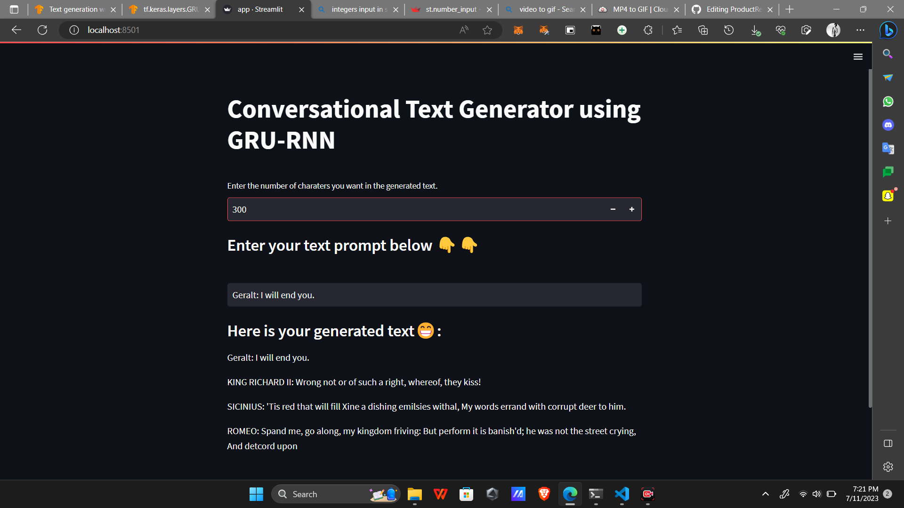

# **Conversational Text Generator using GRU-RNN**
<!-- -->

<!-- <video width="1080" height="720" controls>
  <source src="demo.MP4" type="video/mp4">
</video> -->

#### Dataset: [here](https://storage.googleapis.com/download.tensorflow.org/data/shakespeare.txt) 
#### Understanding the Nitty Gritty: [here](https://www.tensorflow.org/text/tutorials/text_generation) 

### ***`Working: `*** 

